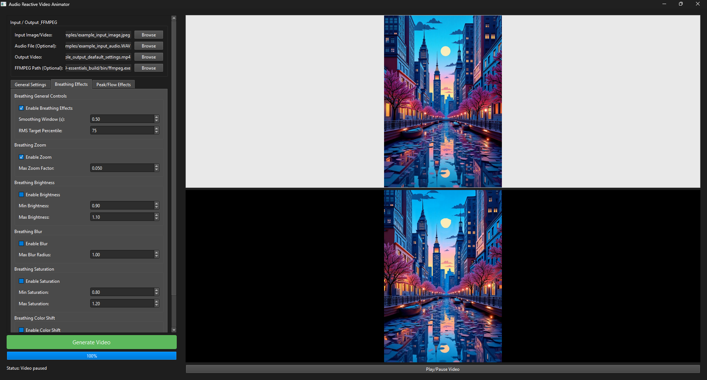

# Audio Reactive Video Animator

## Project Overview

The Audio Reactive Video Animator is a Python-based application designed to create dynamic video animations that respond to audio input. It takes an image or a video and an audio file, then generates an output video where visual effects are synchronized with the sound. Effects include audio-driven optical flow, zoom, brightness changes, blur, saturation adjustments, and color shifts, all configurable through a user-friendly GUI.

This tool is perfect for musicians, visual artists, or anyone looking to create engaging visual content that pulses and warps in time with music or other audio.

## User Interface Preview

Here's a look at the main interface of the Audio Reactive Video Animator:



## Features

* **Audio-Reactive Effects**:
    * **Peak-Based Optical Flow**: Creates warping and zooming effects triggered by audio peaks (e.g., drum hits, strong transients).
    * **Breathing Effects**: Generates continuous, smoother modulations (zoom, brightness, blur, saturation, color shift) based on the overall energy or envelope of the audio.
* **Customizable Parameters**: Extensive controls available through the GUI to fine-tune:
    * Audio analysis sensitivity (peak detection, RMS smoothing).
    * Strength, duration, and style of visual effects.
    * Interpolation methods for visual transformations.
* **Input/Output**:
    * Supports common image formats (PNG, JPG, etc.) and video formats (MP4, AVI, etc.) as visual input.
    * Accepts various audio formats (WAV, MP3, FLAC).
    * Outputs MP4 video files, with audio muxed in if an input audio file is provided and FFMPEG is correctly configured.
* **User Interface**: Built with PyQt6, providing an intuitive way to load files, adjust parameters across multiple tabs, and monitor the generation process.
* **Cross-Platform Potential**: Written in Python, with considerations for running on different operating systems (primary development/testing on Windows, FFMPEG path handling).

## Prerequisites

* **Python**: Version 3.8 or newer recommended.
* **FFMPEG**: This is a crucial external dependency required for writing video files, especially for muxing audio.
    * You must download FFMPEG separately and ensure it's either in your system's PATH or you provide the direct path to the `ffmpeg` executable in the application's GUI.
    * Download FFMPEG from [ffmpeg.org](https://ffmpeg.org/download.html).

## Installation

It is highly recommended to use a Python virtual environment to manage project dependencies.

1.  **Clone the Repository**:
    ```bash
    git clone https://github.com/LamEmil/Audio-Reactive-Video-Animator.git
    cd audio-reactive-video-animator
    ```

2.  **Create and Activate a Virtual Environment**:
    * On Windows:
        ```bash
        python -m venv venv
        .\venv\Scripts\activate
        ```
    * On macOS/Linux:
        ```bash
        python3 -m venv venv
        source venv/bin/activate
        ```

3.  **Install Dependencies**:
    A `requirements.txt` file should be included in the repository. Install the necessary Python libraries using pip:
    ```bash
    pip install -r requirements.txt
    ```
    If a `requirements.txt` is not yet available, you will need to install the following manually (versions might vary, these are common ones):
    ```bash
    pip install PyQt6 Pillow numpy opencv-python imageio librosa
    ```
    * `PyQt6`: For the graphical user interface.
    * `Pillow`: For image manipulation.
    * `numpy`: For numerical operations, especially array manipulations.
    * `opencv-python`: (cv2) For optical flow calculations and video writing.
    * `imageio`: For reading input video files and potentially writing.
    * `librosa`: For advanced audio analysis (onset detection, RMS).

4.  **Verify FFMPEG Installation**:
    Ensure FFMPEG is installed and accessible. You can test this by opening a terminal or command prompt and typing `ffmpeg -version`. If it's not recognized, you'll need to add its installation directory (the `bin` folder containing `ffmpeg.exe` or `ffmpeg`) to your system's PATH environment variable, or note down the full path to provide in the GUI.

## Usage

1.  **Navigate to the Project Directory**:
    Open a terminal or command prompt and change to the directory where you cloned the project.

2.  **Activate Virtual Environment** (if you created one):
    * Windows: `.\venv\Scripts\activate`
    * macOS/Linux: `source venv/bin/activate`

3.  **Run the Application**:
    * On Windows, you can use the provided batch file:
        ```bash
        run.bat
        ```
    * Alternatively, on any OS, run the main GUI script using Python:
        ```bash
        python main_gui.py
        ```

4.  **Using the GUI**:
    * **Input/Output & FFMPEG Tab**:
        * **Input Image/Video**: Browse and select your source image or video file. A preview will be shown.
        * **Audio File (Optional)**: Browse and select your audio file. This is required for audio-reactive effects.
        * **Output Video**: Specify the path and filename for the generated MP4 video.
        * **FFMPEG Path (Optional)**: If `ffmpeg` is not in your system PATH, provide the full path to the `ffmpeg` executable here (e.g., `C:/ffmpeg/bin/ffmpeg.exe`). Defaults to `ffmpeg`.
    * **Parameter Tabs (General Settings, Breathing Effects, Peak/Flow Effects)**:
        * Adjust various parameters to control the audio analysis and the behavior of visual effects. Tooltips or descriptive labels should guide you.
    * **Generate Video**: Once inputs are set and parameters configured, click this button to start the video generation process.
    * **Progress Bar & Status Label**: Monitor the progress and status of the video generation.
    * **Preview Panel**: The input image/video is previewed here. After generation, the output video can be played back in the video player widget.

## File Structure

The project is organized into several Python modules:

* `main_gui.py`: The main application script containing the PyQt6 GUI and overall application logic.
* `worker.py`: Handles the video processing in a separate thread to keep the GUI responsive.
* `logic.py`: Contains the core animation logic, processing frames based on audio analysis and parameters.
* `audio_utils.py`: Utility functions for audio analysis (peak detection, RMS envelope) using Librosa.
* `image_utils.py`: Utility functions for image transformations (zoom, blur, color adjustments) using Pillow.
* `flow_utils.py`: Utility functions for optical flow calculations using OpenCV.
* `run.bat`: A batch script for easily launching the application on Windows.
* `requirements.txt`: (Recommended) Lists Python package dependencies.

## Troubleshooting

* **"Librosa failed to import" / "Numba needs NumPy..."**: This often indicates a version mismatch between `librosa`, `numba`, and `numpy`. Try creating a fresh virtual environment and installing the libraries. Sometimes specific versions are required to work together. Check Librosa's documentation for compatible NumPy/Numba versions.
* **"FFMPEG not found" / Silent Video Output**:
    * Ensure FFMPEG is installed correctly.
    * Verify that the `ffmpeg` executable is in your system's PATH, or provide the full, correct path in the GUI's FFMPEG Path field.
    * The application attempts to use `ffmpeg` directly for muxing audio.
* **Slow Performance**: Video processing, especially optical flow, can be computationally intensive.
    * Processing smaller resolution images/videos will be faster.
    * The `Flow Calc Scale Factor` in the Peak/Flow Effects tab can significantly impact performance (lower values are faster but may reduce flow quality).
    * Ensure you have sufficient RAM and CPU resources.


Released under MIT liscence
